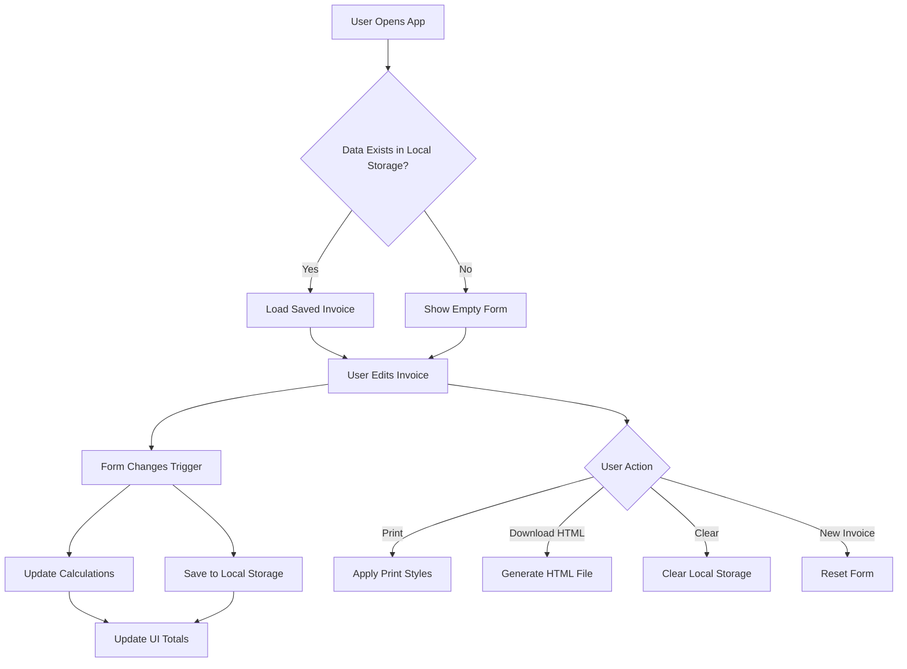

# Simple Invoice Generator - Architectural Plan

## Overview
A modern, responsive web application for creating, editing, and exporting professional invoices using vanilla HTML/CSS/JavaScript.

## Technology Stack
- **HTML5**: Semantic markup for structure
- **CSS3**: Modern CSS with custom properties, Flexbox, Grid, media queries
- **JavaScript (ES6+)**: Modern JavaScript with modules, local storage, DOM manipulation

## Project Structure
```
invoice-generator/
├── index.html          # Main HTML file
├── css/
│   ├── style.css       # Main stylesheet
│   └── print.css       # Print-specific styles for PDF
├── js/
│   ├── app.js          # Main application logic
│   ├── calculator.js   # Invoice calculations
│   ├── storage.js      # Local Storage operations
│   ├── export.js       # Export functionality (HTML, Print)
│   └── utils.js        # Utility functions
├── assets/
│   └── icons/          # SVG icons
└── plans/
    └── architectural-plan.md
```

## Core Features

### 1. Invoice Form Sections
- **Header**: Company logo upload, company name, address, contact info
- **Invoice Details**: Invoice number, issue date, due date, currency
- **Client Information**: Client name, address, email, phone
- **Line Items**: Dynamic rows with description, quantity, price, tax rate, total
- **Notes**: Additional notes or terms

### 2. Calculations
- Subtotal calculation
- Tax calculation (per line item)
- Grand total calculation
- Currency formatting

### 3. Local Storage Persistence
- Auto-save invoice data on changes
- Load saved data on page refresh
- Clear saved data option
- Multiple invoice support (optional)

### 4. Export Options
- **Print to PDF**: Browser print dialog with optimized print styles
- **Download as HTML**: Self-contained HTML file with embedded styles
- **Print Preview**: Preview before printing

### 5. Responsive Design
- **Mobile First**: Optimized for mobile devices
- **Tablet**: Two-column layout for medium screens
- **Desktop**: Full three-column or two-column layout
- **Print**: Clean, professional print layout

## User Interface Design

### Color Scheme
- Primary: #2563eb (Blue)
- Secondary: #64748b (Slate)
- Background: #f8fafc (Light slate)
- Text: #1e293b (Dark slate)
- Success: #22c55e (Green)
- Danger: #ef4444 (Red)

### Typography
- Font: Inter or system-ui
- Headings: Bold, clear hierarchy
- Body: Readable, good line height

### Components
- Form inputs with floating labels
- Dynamic line item rows with add/remove buttons
- Sticky header for actions
- Toast notifications for actions

## Data Structure

### Invoice Object
```javascript
{
  id: string,
  company: {
    name: string,
    address: string,
    email: string,
    phone: string,
    logo: dataURL or null
  },
  invoiceDetails: {
    number: string,
    issueDate: string,
    dueDate: string,
    currency: string
  },
  client: {
    name: string,
    address: string,
    email: string,
    phone: string
  },
  lineItems: [{
    description: string,
    quantity: number,
    price: number,
    taxRate: number,
    total: number
  }],
  notes: string,
  subtotal: number,
  taxTotal: number,
  grandTotal: number
}
```

## Implementation Phases

### Phase 1: Foundation
- [ ] Create project structure
- [ ] Build HTML with semantic markup
- [ ] Set up CSS custom properties

### Phase 2: Core Functionality
- [ ] Line item management (add, remove, edit)
- [ ] Calculations (subtotal, tax, total)
- [ ] Form validation

### Phase 3: Data Persistence
- [ ] Local Storage integration
- [ ] Auto-save functionality
- [ ] Load saved data on startup

### Phase 4: Export Features
- [ ] Print to PDF styles
- [ ] Download as HTML functionality
- [ ] Print preview

### Phase 5: Polish
- [ ] Responsive design testing
- [ ] Accessibility improvements
- [ ] Error handling
- [ ] User experience refinements

## Mermaid Diagram: Application Flow



## Key Design Decisions

### Why Vanilla JavaScript?
- No build tools required
- Fast loading
- Easy to understand and modify
- No framework overhead
- Perfect for this scope

### Local Storage Approach
- Saves complete invoice state
- Auto-saves on every change
- No server required
- Data persists across sessions

### Print Strategy
- Use CSS `@media print` for PDF optimization
- Hide form elements, show invoice only
- Clean, professional output
- No external libraries needed

### HTML Export
- Self-contained HTML file
- Embedded CSS for offline viewing
- Professional formatting
- Easy to share and archive

## Success Criteria
- [ ] Clean, modern UI
- [ ] Fully responsive design
- [ ] Accurate calculations
- [ ] Data persists between sessions
- [ ] Professional print output
- [ ] Easy to use and understand
- [ ] Fast performance
- [ ] Accessible to all users

## Next Steps
1. Approve this architectural plan
2. Switch to Code mode for implementation
3. Build the application phase by phase
4. Test and iterate based on results
